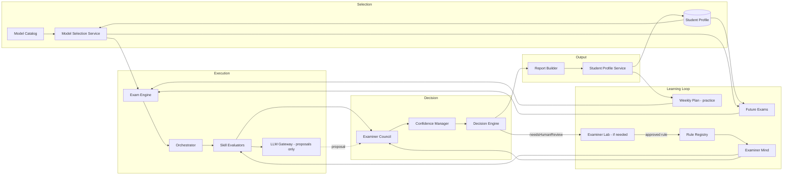

# AustriaPath Unified Exam Platform — Phase A Architecture

**Version:** 1.0  
**Date:** 4 July 2026  
**Status:** Architecture contracts only — **not implemented**  
**Approved decisions:** Weekly = practice-only (no official level change) · Single Rule Registry · LLM assistant only · One Exam Engine (IntelligentExam merged) · Human review visible only when report changed/confirmed

---

## Purpose

Phase A defines **one continuous examination lifecycle** with no isolated subsystems.  
No UI redesign. No backend. No production OpenAI integration.

**Deliverables:**

| Artifact | Location |
|----------|----------|
| Type contracts & interfaces | `src/exam-platform/contracts.js` |
| Product policies (config) | `src/exam-platform/productPolicies.js` |
| Rule Registry schema | `src/exam-platform/ruleRegistrySchema.js` |
| Lifecycle stages | `src/exam-platform/lifecycle.js` |
| Legacy integration map | `src/exam-platform/integrationMap.js` |
| Platform README | `src/exam-platform/README.md` |

---

## Architectural Principle

> **One Exam Engine, many product policies.**  
> Placement, Weekly Plan, AI Single Exam, Intensive Week, and Premium Month are **products**, not separate systems.

OpenAI is a **language assistant**. **AustriaPath Examiner Mind** (Rule Registry + Skill Evaluators + Examiner Council) is the **examiner**.

---

## Complete Lifecycle (Continuous — No Breaks)



**Nothing in this chain is optional or standalone.** Weekly Plan and Future Exams **re-enter** the same Exam Engine via Model Selection reading the updated Profile.

---

## Component Responsibilities

### 1. Exam Engine (`IExamEngine`)

**Owner of the examination session lifecycle.**

| Responsibility | Detail |
|----------------|--------|
| Start / pause / resume / complete | Single entry for all products |
| Load product policy | From `ProductPolicies` |
| Request blueprint | From Model Selection Service |
| Delegate orchestration | To Orchestrator |
| Collect section results | From Orchestrator |
| Invoke Examiner Council | On completion (or per policy) |
| Trigger Report Builder | After Council decision |
| Trigger Profile update | After report finalized |
| Route to Examiner Lab | Only when `needsHumanReview === true` |

**Does not:** score answers directly, pick models randomly, write reports without Council.

---

### 2. Model Selection Service (`IModelSelectionService`)

**Intelligent exam construction — no random selection.**

| Input | Source |
|-------|--------|
| `productType` | Subscription / session context |
| `officialExamLevel` | Profile (never from weekly alone) |
| `weakSkills`, `recurringMistakes` | Profile |
| `usedModelIds` | Profile global + package scope |
| `examIndex` | 1..N within package |
| `difficultyPolicy` | Product policy |

| Output | `ExamBlueprint` — ordered sections with modelId, skill, difficulty |

**Rules (deterministic v1):**

1. Exclude all `usedModelIds` (hard)
2. Weight weak skills × 2.0, neutral × 1.0, strong × 0.5
3. Difficulty band: official level ± 1 step max
4. Variety: rotate primary skill emphasis across package exams
5. Subscription progression: month pack increases difficulty faster than single exam

---

### 3. Exam Orchestrator (`IExamOrchestrator`)

| Responsibility | Detail |
|----------------|--------|
| Section order | From blueprint |
| Skill transitions | Timers, prompts, save answers |
| Per-section evaluation | Call Skill Evaluator after each section |
| Adaptive branching | **Only** if product policy allows (placement) |
| Timing | Hard (premium) vs soft (weekly) per policy |
| Completion | Emit `SectionResult[]` to Exam Engine |

---

### 4. Skill Evaluators (`ISkillEvaluator` registry)

**One specialized evaluator per skill.** Produces `SectionEvaluation` — never final CEFR.

| Skill | Evaluator ID | Primary method |
|-------|--------------|----------------|
| Schreiben | `writing` | Rubric + structure; LLM proposal optional |
| Lesen | `reading` | Answer-key MCQ/cloze |
| Hören | `listening` | Answer-key + comprehension |
| Bildbeschreibung | `picture_description` | Oral description rubric |
| Planung | `planning` | Dialog structure rubric |
| Diskussion | `discussion` | Argumentation rubric |

**Merged:** `IntelligentExamScreen` conversational flow → orchestrator speaking sections + LLM Gateway (proposals only).

Evaluators load rules from **Rule Registry** at `rulesVersion`.

---

### 5. LLM Gateway (`ILLMGateway`) — Phase B+ only

| Allowed | Forbidden |
|---------|-----------|
| Language analysis proposals | Direct final scores |
| Follow-up question text | Direct CEFR assignment |
| Narrative draft for Report Builder | Bypassing Council |
| Structured JSON matching schema | Unvalidated free text → profile |

All LLM output type: `LLMProposal` → Council validates or discards.

**Phase A:** interface only; no production OpenAI calls.

---

### 6. Examiner Council (`IExaminerCouncil`)

**Sole authority for final examination decision.**

| Sub-component | Role |
|---------------|------|
| Fusion judges | Cross-skill coherence (not duplicate skill scoring) |
| Confidence Manager | Thresholds per product; `needsHumanReview` flag |
| Decision Engine | Weighted fusion, critical rules, conflicts |
| CEFR Mapper | Level-aware mapping (incl. B2 context) |

**Output:** `CouncilDecision` — the only object Report Builder may use for grades.

---

### 7. Report Builder (`IReportBuilder`)

| Field | Always |
|-------|--------|
| `cefrLevel`, `overallScore`, `confidence` | ✓ |
| `skillResults[]` | Per skill score + evidence |
| `strengths`, `weaknesses`, `recurringMistakes` | ✓ |
| `readinessBand` | Premium / placement |
| `recommendations`, `studyAdvice` | ✓ |
| `akademieTopicIds`, `weeklyFocusSkills` | Internal links |
| `evaluationMethod` | `examiner_mind` \| `practice_heuristic` |
| `rulesVersion`, `examinerMindVersion` | Audit |
| `humanReview` | **Only if** review changed/confirmed report |
| `disclaimer` | Not official ÖIF/ÖSD/TELC certification |

---

### 8. Student Profile Service (`IStudentProfileService`)

**Single canonical learning state.**

| Field | Updated by |
|-------|------------|
| `officialExamLevel` | Placement + **premium exams only** |
| `skillLevels` (official) | Premium exams + placement |
| `practiceHistory`, `practiceStats` | Weekly plan sessions |
| `weakSkills`, `recurringMistakes` | All reports (weighted) |
| `usedModelIds` | All exam-mode sessions |
| `examHistory` | Premium / placement |
| `readinessBand` | Premium exams |

**Invariant:** Weekly plan **must never** write to `officialExamLevel` or official `skillLevels`.

---

### 9. Weekly Learning Plan (product policy)

Uses Profile + latest reports for default focus.  
Runs Exam Engine with `product: weekly_plan`, `mode: practice`.  
Updates practice fields only.

---

### 10. Future Exams (product policies)

Each premium exam reads updated Profile before Model Selection.  
Progression rules adjust difficulty weights — not official level from weekly.

**Multi-exam packages (Intensive Week / Premium Month):**

- Remember all prior exam results in `StudentProfile.examHistory` and `activePackage.usedModelIdsInPackage`
- **Hard exclude** previously used model IDs within the package (and globally per policy)
- Gradually adapt: weak skills weighted higher, difficulty ±1 step between exams, skill rotation across exam 1→N
- Never repeat the same full exam blueprint within a package

---

### 11. Coaching Notifications (event-driven)

Smart notifications are **not** a separate spam channel. They are **coaching messages** triggered by real events.

| Rule | Detail |
|------|--------|
| Event-driven only | No daily generic reminders |
| Weekly Plan cap | **Max 2 meaningful messages per week** for weekly subscribers |
| Content | Must reference real `weakSkills` / `recurringMistakes` / latest report |
| Debounce | Min 48h between messages; suppress if user practiced in last 24h |
| Triggers | Weak skill detected, exam completed, practice milestone, readiness change, lab review completed (student-visible only) |

Contract: `src/exam-platform/notificationPolicy.js`  
UI notification surfaces unchanged — only internal send/eligibility logic.

---

### 12. Examiner Lab (human queue only)

**Entry:** `CouncilDecision.needsHumanReview === true` (not all low-confidence telemetry).

| Action | Effect |
|--------|--------|
| Approve | Confirm report; optional rule promotion |
| Reject | Flag report; student sees dispute disclaimer if published |
| Correct | Override with reason → student sees `humanReview` block |
| New rule | Structured entry → Rule Registry pending approval |

Internal QA reviews **do not** surface to students.

---

### 13. Rule Registry → Examiner Mind

**Single source of truth** for all examiner rules.

```
Rule Registry
  ├── meta (version, updatedAt, approvedBy)
  ├── globalPrinciples[]
  ├── levels.{A2|B1|B2}.skills.{skill}.rubrics
  ├── criticalRules[]
  └── promotedRules[]  ← from Examiner Lab only
```

Examiner Mind = Rule Registry + Evaluators + Council.  
Every human-approved rule is loaded by evaluators and council at next `rulesVersion` bump.

**Learning invariant:** Examiner Mind must **NOT** learn from raw AI evaluations. Learning occurs **only** after Examiner Lab human review approves a correction or promotes a rule.

---

## Final Report & Learning Lifecycle (Authoritative)

One continuous chain — no side paths:

```
Student completes exam/practice
  → Skill Evaluators
  → Examiner Council → CouncilDecision
  → Final Report (normal path)
  → Student Profile update
       │
       ├─ (typical) Report stored in student history only — NOT Examiner Lab
       │
       └─ (only if CouncilDecision.needsHumanReview === true)
            → Examiner Lab queue
            → Human approve / reject / correct / propose rule
            → (if rule approved) Rule Registry update
            → Examiner Mind (next rulesVersion)
```

Normal reports: **Profile + history only.**  
Lab + rule promotion: **exception path only.**

---

## Product Policy Matrix

| Policy key | Placement | Weekly | AI Single | Intensive | Premium Month |
|------------|-----------|--------|-----------|-----------|---------------|
| `updatesOfficialLevel` | ✓ | ✗ | ✓ | ✓ | ✓ |
| `mode` | diagnostic | practice | exam | exam | exam |
| `adaptivity` | high | medium | low | medium | medium |
| `timingStrict` | low | soft | high | high | high |
| `sectionsFullExam` | partial | partial | full | full | full |
| `examCount` | 1 | n/a | 1 | 3 | 5 |
| `labEligible` | optional | ✗ | ✓ | ✓ | ✓ |
| `llmAllowed` | stub | minimal | proposals | proposals | proposals |

Full definitions: `src/exam-platform/productPolicies.js`

---

## Data Flow (End-to-End)

### Premium exam session

```
1. Screen (unchanged UI) → ExamEngine.start({ product: 'ai_exam', ... })
2. ProfileService.load() → officialExamLevel, usedModelIds, weaknesses
3. ModelSelectionService.select() → ExamBlueprint
4. Orchestrator.run(blueprint) → for each section:
     a. Present section (existing UI components)
     b. SkillEvaluator.evaluate(section) → SectionEvaluation
     c. Optional LLMGateway.propose() → LLMProposal (discarded if invalid)
5. ExaminerCouncil.decide(sectionEvaluations[]) → CouncilDecision
6. If needsHumanReview → ExaminerLabQueue.add (async; exam may complete with pending flag)
7. ReportBuilder.build(decision, product) → FinalReport
8. ProfileService.merge(report) → official level IF product.updatesOfficialLevel
9. Persist report → storage adapter (localStorage now)
10. Next exam: goto 1 with updated Profile
```

### Weekly practice session

```
Same as above with product: 'weekly_plan'
Step 8: ProfileService.mergePractice(report) ONLY — no official level change
```

---

## Integration Points (Legacy → Unified)

See `src/exam-platform/integrationMap.js` for file-by-file migration map.

**Screens (UI unchanged — swap internal calls in Phase B+):**

| Screen | Becomes |
|--------|---------|
| `PlacementTestScreen` | `ExamEngine.start(placement_test)` |
| `AISessionScreen` / `WeeklyPlanSessionScreen` | `ExamEngine.start(weekly_plan)` |
| `PremiumExamSessionScreen` | `ExamEngine.start(ai_exam \| intensive \| month)` |
| `IntelligentExamScreen` | **Removed as separate path** — speaking via Orchestrator |

**Retire as authoritative logic (Phase B–F):**

- `premiumExamBuilder` random pick → Model Selection adapter
- `AISessionScreen` heuristics → Skill Evaluators
- Duplicate `austriaPathAiSession` / `austriaPathCurrentAISession` → ProfileService session handle
- `aiPremiumLibrary` runtime split → Model Catalog + Rule Registry
- `austriaPathAiPrueferLibrary` separate rules → Rule Registry

---

## Storage Schema (Phase A — client target)

Unified keys (migration in later phase):

| Key | Content |
|-----|---------|
| `austriaPathStudentProfileV2` | Canonical StudentProfile |
| `austriaPathExamReports` | FinalReport[] |
| `austriaPathRuleRegistry` | Rule Registry document |
| `austriaPathExaminerLabQueue` | Pending human reviews |
| `austriaPathExamSession` | In-progress ExamSession state |

Legacy keys remain until Phase H migration. See integration map.

---

## Phase Boundaries

| Phase | Scope |
|-------|-------|
| **A (this document)** | Contracts, schemas, responsibilities — **no runtime** |
| B | Model Selection + Profile merge |
| C | Skill Evaluators (MCQ first) |
| D | Orchestrator + Exam Engine wiring |
| E | Council refactor + Report Builder |
| F | Product policies for all five products |
| G | Examiner Lab + Rule Registry loop |
| H | Backend persistence |

---

## Permanent Product Principles (Approved)

These eight principles govern all implementation phases:

1. **Examiner Lab** — High-value learning cases only (~1/week); never all reports. See `examinerLabPolicy.js`.
2. **Notifications** — Event-driven, max 2/week for Weekly Plan; weakness-based. See `notificationPolicy.js`.
3. **Reports** — Central structured product; comparable over time. See `FinalReport` in `contracts.js`.
4. **Subscriptions** — Product policies; Engine validates before premium exams. See `subscriptionPolicy.js`.
5. **Student Profile** — Long-term memory; summaries not duplicates. See `studentProfileService.js`.
6. **Examiner Mind** — AI proposes; Council decides; Registry is truth. Human-approved rules only.
7. **Scalability** — AI-model agnostic; OpenAI replaceable.
8. **Mission** — Trustworthy digital examiner. See `permanentPrinciples.js`.

---

Before Phase B implementation, confirm:

- [ ] Lifecycle diagram matches product vision
- [ ] Weekly / official level invariant acceptable
- [ ] Rule Registry schema sufficient for admin workflow
- [ ] `CouncilDecision` / `FinalReport` schemas complete
- [ ] Integration map covers all legacy entry points
- [ ] Human review visibility rules clear

---

**Next step after approval:** Phase B — implement Model Selection Service and Student Profile Service behind existing interfaces without UI changes.
