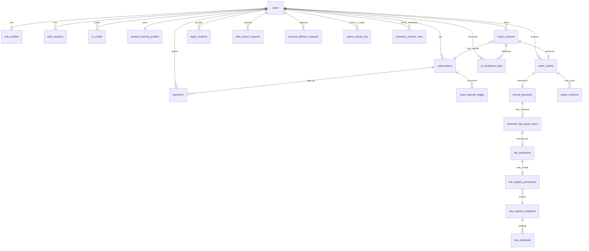
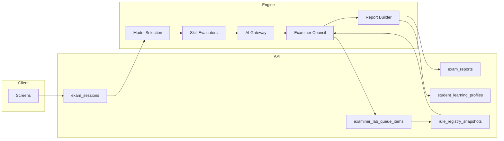
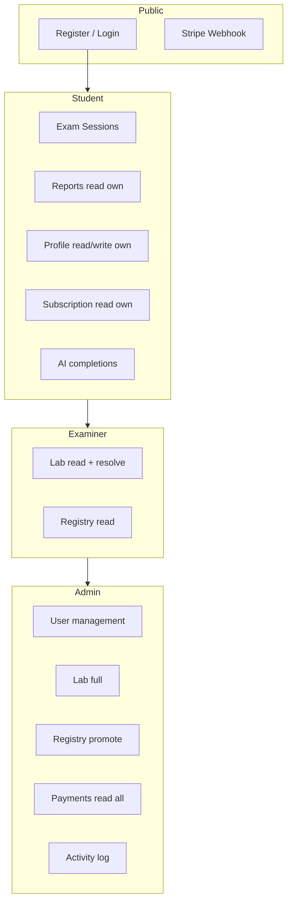

# 03 — Entity Relationships (ERD)

**Contract Pack version:** 2.0.0-gate0

---

## 1. Core domain ERD

---

## 2. Exam platform pipeline ERD

---

## 3. Relationship table

| Parent | Child | Cardinality | FK | On delete |
|--------|-------|-------------|-----|-----------|
| `users` | `user_profiles` | 1:1 | `user_id` | CASCADE |
| `users` | `student_learning_profiles` | 1:1 | `user_id` | CASCADE |
| `users` | `auth_sessions` | 1:n | `user_id` | CASCADE |
| `users` | `subscriptions` | 1:n | `user_id` | CASCADE |
| `users` | `payments` | 1:n | `user_id` | RESTRICT |
| `users` | `exam_sessions` | 1:n | `user_id` | CASCADE |
| `users` | `exam_reports` | 1:n | `user_id` | CASCADE |
| `users` | `ai_credits` | 1:n | `user_id` | CASCADE |
| `users` | `ai_completion_logs` | 1:n | `user_id` | CASCADE |
| `subscriptions` | `payments` | 1:n | `subscription_id` | SET NULL |
| `subscriptions` | `exam_attempt_ledger` | 1:n | `subscription_id` | RESTRICT |
| `exam_sessions` | `exam_reports` | 1:1 | `session_id` | RESTRICT |
| `exam_sessions` | `exam_attempt_ledger` | 1:1 | `session_id` | RESTRICT |
| `exam_reports` | `council_decisions` | 1:1 | `council_decision_id` | RESTRICT |
| `exam_reports` | `report_revisions` | 1:n | `report_id` | CASCADE |
| `council_decisions` | `examiner_lab_queue_items` | 1:n | `council_decision_id` | SET NULL |
| `examiner_lab_queue_items` | `lab_resolutions` | 1:n | `lab_item_id` | CASCADE |
| `lab_resolutions` | `rule_registry_promotions` | 1:n | `lab_resolution_id` | SET NULL |
| `rule_registry_snapshots` | `rule_registry_promotions` | 1:n | `registry_snapshot_id` | RESTRICT |
| `examiner_lab_queue_items` | `rule_proposals` | 1:n | `lab_item_id` | SET NULL |

---

## 4. Legacy compatibility views

These are **read models**, not separate sources of truth:

| Legacy client shape | Canonical table(s) |
|---------------------|-------------------|
| `austriaPathAIReports[]` | `exam_reports` WHERE `legacy_adapter_key` set |
| `austriaPathStudentProfileV2` | `student_learning_profiles.profile_json` |
| `austriaPathRuleRegistry` | Latest `rule_registry_snapshots` row |
| `austriaPathExaminerLabQueue` | `examiner_lab_queue_items` WHERE `status != resolved` |
| `austriaPathSubscription` | `subscriptions` WHERE `is_current = true` |

---

## 5. Admin & examiner access zones

See [05-roles-permissions-matrix.md](./05-roles-permissions-matrix.md).
