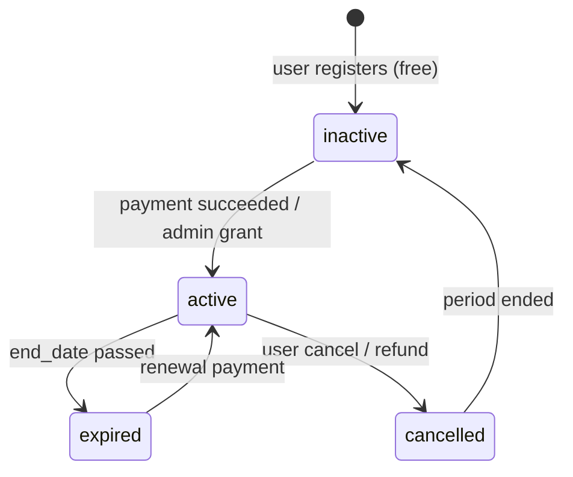

# 06 — Subscription & Payment Lifecycle

**Contract Pack version:** 2.0.0-gate0

---

## 1. State machine — subscription



---

## 2. Plan catalog

| Plan | Engine `product_type` | Price EUR | Duration | `remaining_exams` | AI credits grant |
|------|----------------------|-----------|----------|-------------------|------------------|
| Placement | `placement_test` | 2.00 | One-time | 1 | 30 |
| Weekly Plan | `weekly_plan` | 14.99 | 7 days | 0 | — |
| AI Exam | `ai_exam` | 9.99 | One-time | 1 | 50 |
| Intensive Week | `intensive_week` | 24.99 | 7 days | 3 | 150 |
| Premium Month | `premium_month` | 39.99 | 30 days | 5 | 250 |

Stripe Price IDs stored in server config; mapped in webhook handler.

---

## 3. Checkout flow

```
1. Student → POST /subscription/checkout { planType }
2. API creates Stripe Checkout Session (mode=payment or subscription)
3. Response { checkoutUrl, sessionId }
4. Student completes Stripe UI
5. Stripe → POST /webhooks/stripe (checkout.session.completed)
6. API transaction:
   - INSERT payments
   - UPDATE old subscriptions SET is_current=false
   - INSERT subscriptions (active, remaining_exams, permissions, end_date)
   - UPDATE users.plan
   - INSERT ai_credits grant
   - INSERT admin_activity_log
7. Student → GET /auth/me (updated permissions)
```

**Client must not** set `premiumActive`, `userPlan`, or `austriaPathSubscription` after backend launch.

---

## 4. Consume exam flow

**Endpoint:** `POST /subscription/consume-exam`

**Headers:** `Idempotency-Key` required

**Request:**
```json
{
  "productType": "ai_exam|intensive_week|premium_month",
  "examIndex": 1,
  "examTotal": 3
}
```

**Preconditions:**
- `validateSubscriptionForExam()` rules (engine parity)
- Session not already created for this idempotency key

**Atomic effects:**
1. `exam_attempt_ledger` INSERT
2. `subscriptions.remaining_exams -= 1`
3. Return `{ sessionId, subscription, attemptLedgerId }` OR create session in same transaction via `POST /exam-sessions` combined endpoint

**Recommended:** Single `POST /exam-sessions` performs validation + consume + session create atomically.

---

## 5. Payment record lifecycle

| Status | Meaning |
|--------|---------|
| `pending` | Checkout session created |
| `processing` | PaymentIntent processing |
| `succeeded` | Funds captured; subscription activated |
| `failed` | Payment failed |
| `refunded` | Refund processed; may claw back credits |
| `cancelled` | Checkout abandoned |

---

## 6. Refund policy (contract)

On `charge.refunded` webhook:

1. UPDATE `payments.status = refunded`
2. If full refund: UPDATE `subscriptions.status = cancelled`
3. INSERT `ai_credits` negative entry (`refund_clawback`) if credits were granted
4. Do not delete `exam_reports` already consumed

---

## 7. Subscription snapshot on profile

When exam session starts, engine attaches `subscriptionSnapshot` to session metadata:

```json
{
  "type": "premium_month",
  "status": "active",
  "remainingExams": 4,
  "endDate": "2026-08-03T00:00:00.000Z"
}
```

Stored in `exam_sessions` metadata for audit; profile merge may copy to `student_learning_profiles.subscription_snapshot`.

---

## 8. Expiry handling

| Event | Action |
|-------|--------|
| Cron: `end_date < NOW()` | SET `status = expired`, `is_current = false` |
| Active session when expiry hits | Allow completion if started before expiry (grace 15 min configurable) |
| New session after expiry | `403 SUBSCRIPTION_EXPIRED` |

---

## 9. Admin grant (non-Stripe)

`PATCH /admin/users/{id}/subscription`

Creates subscription row + credit grant + activity log. Used for support/comp accounts only.
