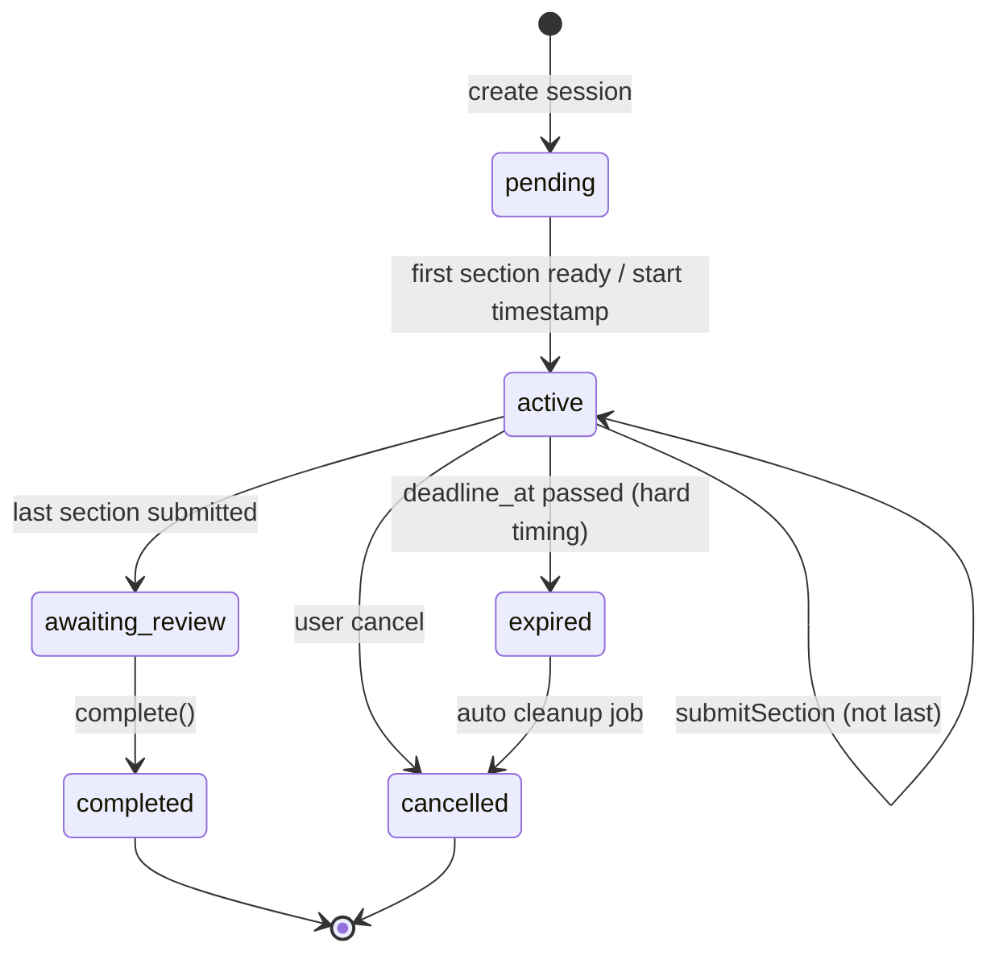

# 07 — Exam Session Lifecycle

**Contract Pack version:** 2.0.0-gate0  
**Engine reference:** `src/exam-platform/examEngine.js`, `examOrchestrator.js`

---

## 1. State machine



---

## 2. API endpoints

| Method | Path | Description |
|--------|------|-------------|
| POST | `/exam-sessions` | Start session (select blueprint) |
| GET | `/exam-sessions/{id}` | Get session state |
| POST | `/exam-sessions/{id}/sections` | Submit section answer |
| POST | `/exam-sessions/{id}/complete` | Run council + report + profile |
| POST | `/exam-sessions/{id}/cancel` | Cancel session |
| GET | `/exam-sessions/active` | Resume active session for product |

---

## 3. POST `/exam-sessions` — Start

**Request:** `ExamSessionStartRequest`

```json
{
  "productType": "ai_exam",
  "levelOverride": "B1",
  "examIndex": 1,
  "examTotal": 5,
  "focusSkillsOverride": ["writing", "listening"],
  "blueprint": null,
  "idempotencyKey": "uuid"
}
```

**Server pipeline:**
1. Auth + entitlements
2. Premium: atomic subscription consume (if not already consumed for this key)
3. Load `student_learning_profiles`
4. Load current `rule_registry_snapshots.registry_version`
5. `selectBlueprint()` or accept pre-built `blueprint`
6. `applySessionTiming()` if hard timing
7. INSERT `exam_sessions` status=`active`
8. Return `ExamSessionStartResponse`

**Response:**
```json
{
  "sessionId": "uuid",
  "session": { "ExamSessionState": "..." },
  "currentSection": { "BlueprintSection": "..." },
  "sectionContent": { },
  "rulesVersion": "1.2.0",
  "deadlineAt": "2026-07-04T12:00:00.000Z"
}
```

---

## 4. POST `/exam-sessions/{id}/sections` — Submit

**Request:**
```json
{
  "answer": {
    "sectionIndex": 0,
    "skill": "reading",
    "modelId": "b1-lesen-001",
    "mcqAnswers": { "q1": "B" },
    "freeText": null,
    "durationSeconds": 420
  }
}
```

**Server pipeline:**
1. Validate session `active`, section index matches
2. Hard timing: reject if `NOW() > deadline_at` → `410 SESSION_EXPIRED`
3. `evaluateSection()` via skill evaluator registry
4. Optional `llmGateway.proposeSectionAnalysis()` if policy allows
5. Append answer + evaluation; advance index
6. Last section → status `awaiting_review`

**Response:**
```json
{
  "evaluation": { "SectionEvaluation": "..." },
  "llmProposals": [],
  "session": { "..." },
  "nextSection": { "..." }
}
```

---

## 5. POST `/exam-sessions/{id}/complete` — Complete

**Headers:** `Idempotency-Key` required

**Preconditions:** `isSessionComplete` OR status `awaiting_review`

**Server pipeline:**
1. `proposeSessionSummary()` if `llmProposalsAllowed`
2. `decideCouncil()` with **storage/registry loaded**
3. `buildFinalReport()`
4. `mergeReportIntoProfile()` per product policy
5. `recordPackageModelUsage()` if multi-exam product
6. `maybeEnqueueLabCase()` if eligible
7. INSERT `council_decisions`, `exam_reports`
8. UPDATE `student_learning_profiles`
9. UPDATE session status `completed`

**Response:** `ExamSessionCompleteResponse`

```json
{
  "report": { "FinalReport": "..." },
  "profile": { "StudentProfile": "..." },
  "pendingHumanReview": true,
  "labEnqueued": true
}
```

**Idempotency:** Same key returns cached complete response without double profile merge.

---

## 6. Timing enforcement (hard products)

Products with `timingPolicy: hard`: `ai_exam`, `intensive_week`, `premium_month`

| Rule | Value |
|------|-------|
| `defaultDurationMinutes` | 90 |
| `deadline_at` | `started_at + duration` |
| Submit after deadline | `410 SESSION_EXPIRED` |
| Background job | Every 5 min: SET status=`expired` WHERE deadline passed |

---

## 7. Package dedup (multi-exam)

For `intensive_week` / `premium_month`:

On start with `examIndex` > 1:
- Load `activePackage` from profile
- Call `setActivePackage(productType, examIndex, examTotal)`
- Selection uses `dedupScope: package`

---

## 8. Rules version pinning

- Blueprint stores `rulesVersion` at session start
- Council uses pinned version + promotions effective **before** `started_at`
- Promotions after start apply to **future** sessions only

---

## 9. Session recovery

| Scenario | Behavior |
|----------|----------|
| Page refresh | `GET /exam-sessions/active?productType=` returns in-progress |
| Device switch | Same — server authoritative |
| Completed idempotent retry | Return existing report |

Redis cache optional; PostgreSQL is source of truth.

---

## 10. Cancel

`POST /exam-sessions/{id}/cancel`

- Allowed: `active`, `awaiting_review`
- Does not refund consumed exam attempt
- Status → `cancelled`
