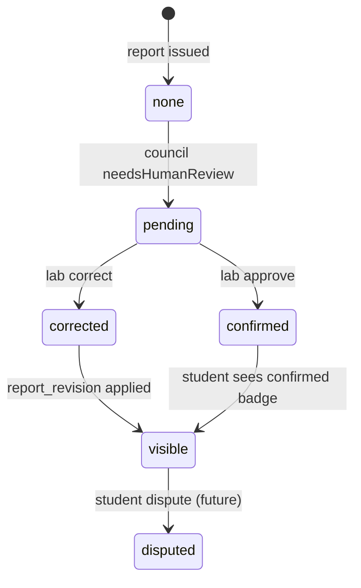

# 08 — Report Lifecycle

**Contract Pack version:** 2.0.0-gate0  
**Schema:** `schemas/final-report.json`

---

## 1. Report creation

Reports are created exclusively by `POST /exam-sessions/{id}/complete` — not by client POST.

Flow:
```
CouncilDecision → buildFinalReport() → exam_reports INSERT → legacy adapter shape for UI
```

---

## 2. FinalReport fields (canonical)

| Field | Type | Notes |
|-------|------|-------|
| `reportId` | UUID | Server-generated |
| `sessionId` | UUID | FK |
| `productType` | enum | |
| `mode` | enum | diagnostic / practice / exam |
| `evaluationMethod` | enum | |
| `cefrLevel` | enum | |
| `overallScore` | 0–100 | |
| `confidence` | 0–100 | |
| `readinessBand` | enum | Optional |
| `skillResults` | object | Per-skill score + level |
| `strengths` | string[] | Human-readable |
| `weaknesses` | string[] | |
| `summary` | string | German narrative |
| `recommendations` | string[] | |
| `disclaimer` | string | Fixed `REPORT_DISCLAIMER` |
| `rulesVersion` | string | |
| `humanReview` | object | Optional — see §4 |
| `councilDecision` | object | Full for admin; truncated for student API |

---

## 3. API endpoints

| Method | Path | Description |
|--------|------|-------------|
| GET | `/reports` | List own reports (paginated) |
| GET | `/reports/{id}` | Report detail |
| GET | `/reports/latest` | Latest report for dashboard |
| GET | `/admin/reports` | Admin list with filters |

**No client POST /reports** after backend launch.

---

## 4. Human review lifecycle



### `HumanReviewPublic` shape

```json
{
  "status": "pending|confirmed|corrected|disputed",
  "summary": "Ihr Ergebnis wurde von einem Prüfer überprüft.",
  "changedReport": true,
  "reviewedAt": "2026-07-04T10:00:00.000Z"
}
```

**Gate 0 requirement:** Lab `correct` action MUST trigger `report_revisions` INSERT and update `exam_reports.humanReview`.

---

## 5. Report revision flow

1. Examiner resolves lab item with `action: correct`
2. Server builds `correctedDecision` → new FinalReport
3. INSERT `report_revisions` (revision_number++)
4. UPDATE `exam_reports` SET `report_json`, `human_review`, scores
5. Optionally UPDATE `student_learning_profiles` if official level affected
6. Notify student (future notification channel)

---

## 6. Legacy adapter mapping

For unchanged UI, API returns dual shape:

| Legacy field (`austriaPathAIReports`) | FinalReport field |
|---------------------------------------|-------------------|
| `title` | Derived from productType + level |
| `type` | productType mapped |
| `level` | cefrLevel |
| `summary` | summary |
| `strengths` | strengths |
| `weaknesses` | weaknesses |
| `strongCount` | computed |
| `evaluationMethod` | evaluationMethod |

Adapter logic mirrors `legacyReportAdapter.js`.

---

## 7. Retention & export

| Event | Action |
|-------|--------|
| Account deletion | CASCADE delete `exam_reports` |
| GDPR export | Include all reports + revisions |
| Superseded report | `is_superseded=true`; latest revision is canonical |

---

## 8. List pagination

```
GET /reports?page=1&limit=20&productType=ai_exam
```

Default sort: `created_at DESC`. Max limit 50.

---

## 9. Student-visible council data

Student API strips from `councilDecision`:

- Full `fusionReports` reasoning chains
- Internal judge IDs
- `criticalRulesApplied` details (keep count only)

Admin/Examiner API returns full decision JSON in `council_decisions.decision_json`.
