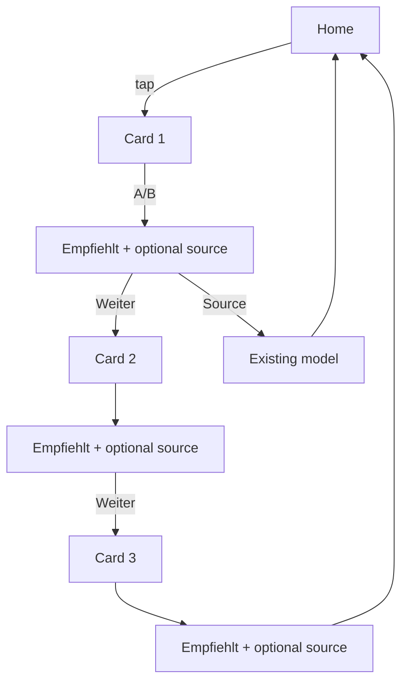

# AustriaPath Daily Learning Bank
## UX Specification — Final (Approved for Implementation)

**Status:** Final — implement from this document  
**Content:** Frozen — do not change card text  
**Volume:** **3 cards per day** (not 1, not configurable)

---

## Product goal

Three very short cards. Around 1–2 minutes total. Calm, friendly, simple.

The learner reads a few short daily tips — not a test, not a lesson, not an exam.

> *Today I learned useful German expressions.*

---

## 1. Home screen

Small card on `HomeScreen` only. No bottom-nav tab. No profile block.

### Localized UI (`screenLabels.js` + `getUserLanguage()`)

| Language | Title | Subtitle (one sentence) |
|----------|-------|-------------------------|
| Deutsch | Lernen wir gemeinsam | Wähle den Ausdruck, der zur Situation passt. |
| العربية | لنتعلم معًا | اختر التعبير الأنسب للموقف. |
| English | Let's Learn Together | Choose the expression that best fits the situation. |
| Türkçe | Birlikte Öğrenelim | Duruma en uygun ifadeyi seç. |
| فارسی | با هم یاد بگیریم | عبارتی را انتخاب کن که با موقعیت سازگار است. |
| Українська | Вчімося разом | Обери вираз, який найкраще підходить до ситуації. |

```
┌─────────────────────────────────────┐
│  Let's Learn Together               │  ← localized title
│  Choose the expression that best    │  ← localized, one line
│  fits the situation.                │
└─────────────────────────────────────┘
```

**Done today:** card muted, subtitle → localized “See you tomorrow”; not tappable.

No card count, time estimate, or progress on Home.

---

## 2. Daily flow

```
Home
  ↓ tap localized title card
Card 1 → choose A or B → AustriaPath empfiehlt → optional source button → Next
Card 2 → choose A or B → AustriaPath empfiehlt → optional source button → Next
Card 3 → choose A or B → AustriaPath empfiehlt → optional source button
  ↓
Close automatically → return to Home
```

**Explicitly absent after card 3:**
- Completion screen
- Congratulations screen
- Statistics / summary / score
- History, saved answers, favourites
- XP, badges, achievements
- Profile integration
- Review page

---

## 3. Card screen — before choice

```
┌─────────────────────────────────────┐
│  ← Zurück                           │  ← localized
├─────────────────────────────────────┤
│                                     │
│  [Situation — German]               │
│                                     │
│  Welche Antwort passt besser?       │  ← German
│                                     │
│  ┌───────────────────────────────┐  │
│  │ A) …                           │  │
│  └───────────────────────────────┘  │
│  ┌───────────────────────────────┐  │
│  │ B) …                           │  │
│  └───────────────────────────────┘  │
│                                     │
└─────────────────────────────────────┘
```

**Do NOT show:** `1/3` · `2/3` · `3/3` · progress bar · percentage · category chips

---

## 4. After the learner chooses

**Do NOT show:** Correct · Wrong · Better answer · Score · Green/red · A vs B comparison

```
┌─────────────────────────────────────┐
│  ← Zurück                           │
├─────────────────────────────────────┤
│  [Situation — unchanged, German]    │
│                                     │
│  AustriaPath empfiehlt:             │
│  [recommended German expression]    │
│                                     │
│  [One short German explanation]     │
│                                     │
│  ┌───────────────────────────────┐  │
│  │  In Schreiben ansehen            │  │  ← optional; ONE button max
│  └───────────────────────────────┘  │
│                                     │
│  Weiter                             │  ← text link, cards 1–2 only
│                                     │
└─────────────────────────────────────┘
```

- **AustriaPath empfiehlt:** — fixed German prefix
- Explanation: one sentence from card `reason` (German)
- **Source button:** optional, German, one only — opens original model
- **Weiter:** advances to next card (cards 1–2). Card 3: no Weiter — auto-return to Home after brief moment OR immediately on dismiss (implementer: ~0ms after last view, no interstitial)

### Source button labels (German)

| Target | Label |
|--------|-------|
| Schreiben | In Schreiben ansehen |
| Planung | In Planung ansehen |
| Bildbeschreibung | In Bildbeschreibung ansehen |
| Grafikbeschreibung | In Grafikbeschreibung ansehen |
| Diskussion | In Diskussion ansehen |
| Akademie (fallback) | In der Akademie ansehen |

---

## 5. Localization rules

| Element | Language |
|---------|----------|
| Home title & subtitle | User app language |
| Back button | User app language |
| Situation, question, A, B | **German** |
| AustriaPath empfiehlt, explanation | **German** |
| Source button | **German** |
| Weiter (if shown) | User app language |

---

## 6. Rotation logic

**3 cards per calendar day.** No repeat until 90-card cycle completes per level.

```
STATE: { level, lastDate, cycleQueue[], cyclePosition, todayCardIds[3] }

On new calendar day:
  Reshuffle cycle if needed (position ≥ 90)
  Pick 3 cards from cycleQueue with category diversity:
    - Avoid 3 cards from same category on one day
    - Prefer: communication (Schreiben/Connector/Vocabulary) +
              scene/planning (Bild/Grafik/Planung) +
              mixed (Meinung/Diskussion/Grammar/Planung)
  Save todayCardIds, lastDate

Same 3 cards if user returns same day.
Level change → reset cycle for new level.
```

Client-side only. No API. No AI.

---

## 7. Navigation



Internal tab: `dailyLearning` (not in bottom nav).

---

## 8. Components & modified files

### New
- `DailyLearningHomeCard.jsx`
- `DailyLearningScreen.jsx` — 3-card flow, recommendation view, auto-close after card 3
- `dailyLearningBank.js` — 270 cards + `sourceRef`
- `dailyLearningRotation.js` — 3/day, category mix, 90-cycle
- `dailyLearningNavigation.js` — sourceRef → tab + model
- `dailyLearningLabels` in `screenLabels.js`

### Modified
- `HomeScreen.jsx`
- `App.jsx` — tab + `navigationContext`
- `WritingScreen`, `PlanningScreen`, `ImageTrainingScreen`, `SpeakingScreen`, `B2ModelsScreen`

### Never add
Favourites · history · stats · XP · badges · achievements · profile · review · completion UI · progress indicators

---

## 9. Implementation checklist

- [ ] 3 cards per day, category-diverse selection
- [ ] No 1/3, progress bar, or percentage anywhere
- [ ] Post-choice: only *AustriaPath empfiehlt* — no right/wrong
- [ ] Optional single source button per card
- [ ] Card 3 ends → Home automatically, no completion screen
- [ ] UI localized; learning content German only
- [ ] Simplicity preserved — reject PRs that add gamification

---

## 10. Sign-off

| Decision | Value |
|----------|-------|
| Cards per day | **3** |
| Total time | **~1–2 minutes** |
| Progress UI | **None** |
| Post-card framing | **AustriaPath empfiehlt:** |
| End of session | **Auto-return Home** |
| Gamification | **None** |
| Ready to implement | **Yes** |
