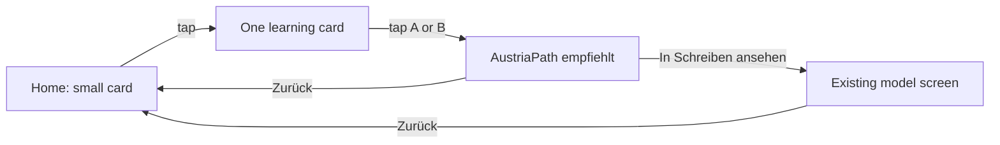

# AustriaPath Daily Learning Bank
## UX Specification v2 (Final — Approved)

**Status:** Approved for implementation  
**Content:** Frozen — do not change card text  
**Philosophy:** One calm daily moment, not a lesson, exam, or grammar drill

---

## Product philosophy

> *Today I learned one useful German expression.*

The learner opens a small helpful message, reads, chooses, discovers one expression, and continues. Nothing else.

**Not allowed:** lessons, exams, grammar exercises, scoring, gamification, history, settings, profile hooks.

---

## 1. Home screen — opening card

A **small card only** on `HomeScreen` — no new bottom-nav tab, no profile block, no banners.

### Localized UI (via `screenLabels.js` + `getUserLanguage()`)

Title and subtitle use the **application localization system** (`src/i18n/screenLabels.js`, same pattern as `writingTitle`, `back`, etc.).

| Language | Title | Subtitle (one sentence only) |
|----------|-------|------------------------------|
| Deutsch | Lernen wir gemeinsam | Wähle den Ausdruck, der zur Situation passt. |
| العربية | لنتعلم معًا | اختر التعبير الأنسب للموقف. |
| English | Let's Learn Together | Choose the expression that best fits the situation. |
| Türkçe | Birlikte Öğrenelim | Duruma en uygun ifadeyi seç. |
| فارسی | با هم یاد بگیریم | عبارتی را انتخاب کن که با موقعیت سازگار است. |
| Українська | Вчімося разом | Обери вираз, який найкраще підходить до ситуації. |

*English added to `screenLabels` when implementation begins (not currently in file; follow same structure).*

### Wireframe — Home card

```
┌─────────────────────────────────────┐
│  Lernen wir gemeinsam               │  ← localized title
│  Wähle den Ausdruck, der zur        │  ← localized, one line max
│  Situation passt.                   │
└─────────────────────────────────────┘
         entire card is tappable
```

**States**
- **Available:** card as above — tap opens today’s card
- **Done today:** same card, muted — subtitle becomes localized “See you tomorrow” (one short line); not tappable

No card count, no time estimate, no progress text on Home.

---

## 2. Daily volume

**One card per day** (revised from v1’s three).

Aligns with: *one short daily learning moment*, *one useful German expression*, *read → choose → discover*.

Rotation: 90-card cycle per level; one new card per calendar day; no repeat until cycle completes.

---

## 3. Learning card screen

### Language rule

| Element | Language |
|---------|----------|
| Home title & subtitle | User’s app language |
| Back button | User’s app language (`labels.back`) |
| Situation, question, A, B, recommendation, explanation | **German only** |
| Source button label | **German only** (exam context) |

### Wireframe — before choice

```
┌─────────────────────────────────────┐
│  ← Zurück                           │  ← localized
├─────────────────────────────────────┤
│                                     │
│  Sie bitten die Zahnarztpraxis um    │
│  einen neuen Termin nach Ihrer       │  ← Situation (DE)
│  Absage.                             │
│                                     │
│  Welche Antwort passt besser?        │  ← Question (DE)
│                                     │
│  ┌───────────────────────────────┐  │
│  │ A) Könnten Sie mir bitte …     │  │
│  └───────────────────────────────┘  │
│  ┌───────────────────────────────┐  │
│  │ B) Ich brauche einen neuen …   │  │
│  └───────────────────────────────┘  │
│                                     │
└─────────────────────────────────────┘
```

- No category label (reduces noise)
- No step indicator (1/3 removed)
- No progress bar
- Two equal answer buttons; tap either to continue

**Target time:** 30–60 seconds total

---

## 4. After the learner chooses

Do **not** show: Correct · Wrong · Better answer · Score · Points · Green/red · Comparison of A vs B

Both answers remain visible but **neither is marked right or wrong**.

Show only:

```
┌─────────────────────────────────────┐
│  ← Zurück                           │
├─────────────────────────────────────┤
│  [Situation — unchanged, DE]        │
│                                     │
│  AustriaPath empfiehlt:             │  ← fixed German label
│                                     │
│  Könnten Sie mir bitte einen neuen  │
│  Termin in der nächsten Woche       │  ← recommended expression (DE)
│  anbieten?                          │
│                                     │
│  Höfliche Bitte — typisch für eine  │  ← max one short sentence (DE)
│  Terminanfrage.                     │
│                                     │
│  ┌───────────────────────────────┐  │
│  │   In Schreiben ansehen           │  │  ← ONE button only
│  └───────────────────────────────┘  │
│                                     │
└─────────────────────────────────────┘
```

- **AustriaPath empfiehlt:** — always this exact prefix (German, product voice)
- Explanation: one sentence from card `reason` field (already ≤1 sentence in content bank)
- **One button only** — opens original AustriaPath model; no “Weiter”, no “Done”, no second CTA
- Learner exits via source button or ← Zurück (returns to Home)

---

## 5. Source button

Single button, German label, mapped from card `sourceRef`:

| Target | Button text |
|--------|-------------|
| Writing models | In Schreiben ansehen |
| Planning models | In Planung ansehen |
| Image models | In Bildbeschreibung ansehen |
| Chart models (B2) | In Grafikbeschreibung ansehen |
| Discussion models (B2) | In Diskussion ansehen |
| Akademie (fallback) | In der Akademie ansehen |

Opens existing screen at correct model — **no content duplication**.

Future (out of v2 scope): highlight related section after navigation.

---

## 6. Removed from v1 plan

| Removed | Notes |
|---------|-------|
| 3 cards per day | → 1 card per day |
| Step indicator (1/3) | Gone |
| Category chip on card | Gone |
| “✓ Besser:” / correct-wrong framing | → “AustriaPath empfiehlt:” |
| Weiter button | Gone |
| Completion screen (“Fertig für heute”) | Gone — back to Home is enough |
| Profile integration | Explicitly removed |
| Favourites, history, stats, XP, badges | Explicitly removed |
| Time estimate on Home (“~3 Min”) | Gone |

---

## 7. Navigation flow



No branches, no loops, no session state UI.

---

## 8. Rotation logic (simplified)

```
STATE: { level, lastDate, cycleQueue[], cyclePosition, todayCardId }

Each calendar day (local):
  IF lastDate ≠ today:
    IF cycle complete → reshuffle 90 cards for user level
    todayCardId ← next card from cycleQueue
    lastDate ← today
    SAVE

User level from getUserLevel() / placement profile.
Same card if user reopens same day.
New card at midnight local time.
```

No category-slot rules required for v2 (one card/day provides natural variety over 90 days). Optional: prefer unused categories from past 7 days — **only if zero complexity cost**; default is pure cycle order with shuffle.

---

## 9. Where it lives

| Location | Role |
|----------|------|
| `HomeScreen` | Small opening card only |
| `dailyLearning` tab (internal) | Full-screen card — not in bottom nav |
| Existing trainers | Destination for source button |

**Not in:** bottom nav · Profile · Premium · Placement · Akademie entry · Settings

---

## 10. Components & files

### New UI
- `DailyLearningHomeCard.jsx` — localized Home card
- `DailyLearningScreen.jsx` — single card + recommendation view
- `dailyLearningLabels` in `screenLabels.js` — title, subtitle, doneTomorrow

### New logic (unchanged from v1 plan, simplified rotation)
- `dailyLearningBank.js` — 270 cards, frozen content
- `dailyLearningRotation.js` — 1/day, 90-cycle
- `dailyLearningNavigation.js` — sourceRef → tab + model

### Modified
- `HomeScreen.jsx` — embed home card
- `App.jsx` — `dailyLearning` tab + `navigationContext`
- `WritingScreen`, `PlanningScreen`, `ImageTrainingScreen`, `SpeakingScreen`, `B2ModelsScreen` — accept `navigationContext` on mount
- `screenLabels.js` — daily learning strings for all supported languages

### Not created
- History, stats, favourites, settings, profile widgets, completion screens

---

## 11. Implementation order

1. Add `dailyLearningLabels` to `screenLabels.js` (all languages)
2. Package `dailyLearningBank.js` from approved markdown + `sourceRef`
3. `dailyLearningRotation.js` (1 card/day)
4. `DailyLearningScreen` — minimal two-state UI (choose → empfiehlt)
5. `DailyLearningHomeCard` on Home
6. `dailyLearningNavigation.js` + wire source button
7. Target screens: honour `navigationContext`
8. Manual QA: calm, no gamification, German content only on card

**Preserve simplicity as a product constraint** — reject any implementation PR that adds scoring, streaks, or extra screens.

---

## 12. Sign-off

| Item | v2 decision |
|------|-------------|
| Cards per day | **1** |
| UI language | User app language (localized) |
| Learning language | German only |
| Post-choice framing | **AustriaPath empfiehlt:** |
| Buttons after choice | **One** (source only) |
| Gamification | **None** |
| Profile | **None** |
| Ready to implement | **Yes** |
